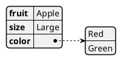
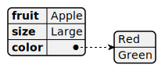

# Diagrams

This is a repo that houses [plantuml](https://plantuml.com/) files (.puml)

Examples:
- gantt-example
- uml-example

## How to add PlantUML to a markdown file

See [here](https://gist.github.com/noamtamim/f11982b28602bd7e604c233fbe9d910f). 

Tip: Run `plantuml -o assets -checkmetadata -tsvg README.md` to generate the ref svgs.

Code:

```plantumlcode assets/README.svg
@startjson
{
   "fruit":"Apple",
   "size": "Large",
   "color": ["Red", "Green"]
}
@endjson

```

Output:
<div hidden>

</div>



*NOTE: GitHub doesn't support PlantUML natively. Use the above-mentioned "Generate URLs for Current File Diagrams" or "Generate URL for Current Diagram" commands to generate diagrams and use them in a README markdown file.*

---

References:
- [ ] https://www.youtube.com/watch?v=EM-cvRubP4g&list=PLPPxJMwitEl0-J8xO_z7SzjI9UTYH7dvz
- [ ] https://medium.com/mkdir-awesome/getting-started-with-plantuml-with-vscode-c45427aaadd3
- [ ] https://hittheroad.dev/using-plantuml-inside-vscode-and-wsl2-2a4e3b2b0898